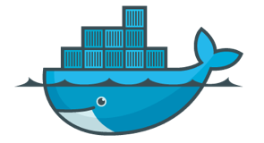
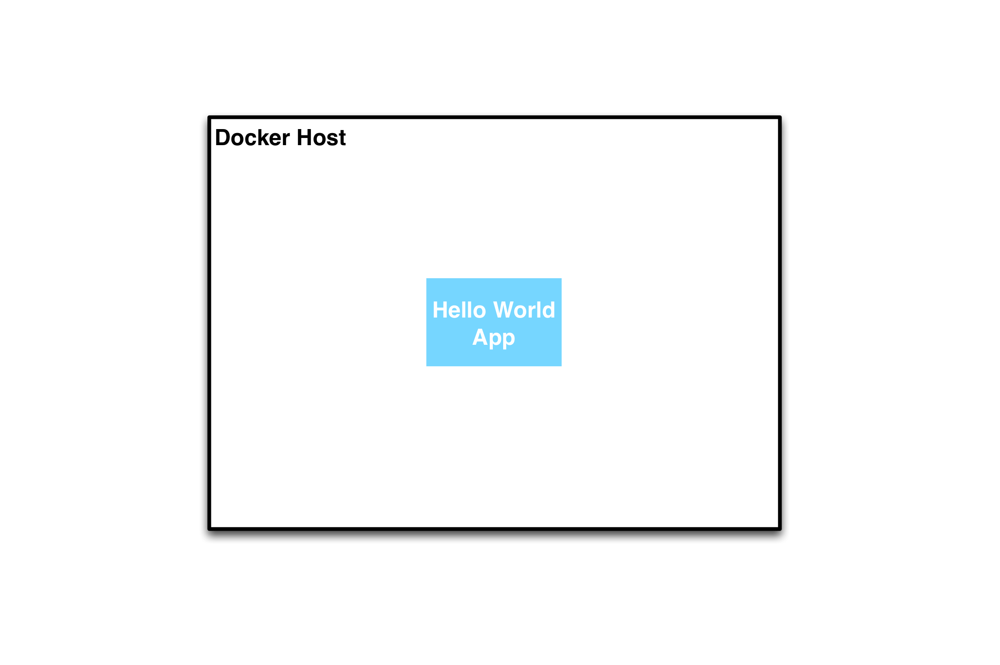
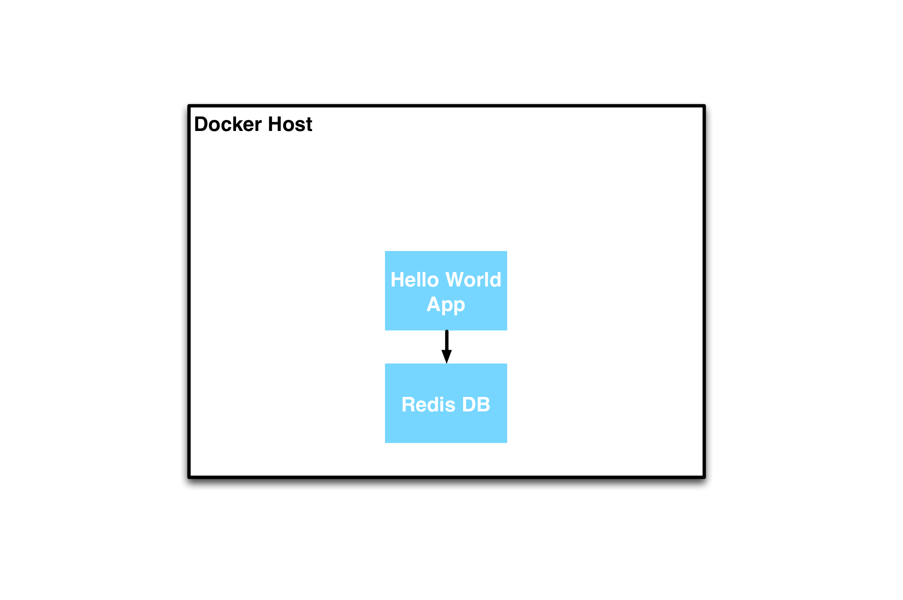
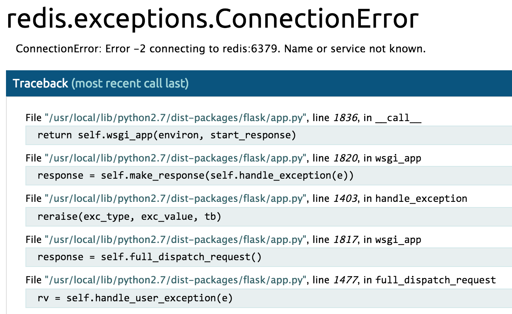

# Vagrant
 <!-- .element: class="noborder" -->


!SUB
## Vagrant introduction
Vagrant needs no introduction ;)

But here's one anyway


!SUB
### Vagrant features

 - Easy to configure, reproducible, and portable work environments
 - Provisions on top of VirtualBox, VMware, AWS, or any other provider
 - Install software with tools such as shell scripts, Chef, or Puppet

[_vagrantup.com_](https://www.vagrantup.com/)


!SUB
### Vagrant works with

 - Configuration with Vagrantfile
 - Providers (VirtualBox, VMware, AWS, Docker, ...)
 - Provisioners (Shell, Puppet, Chef, Salt, ...)

[_Vagrant Docs_](https://docs.vagrantup.com/v2/)


!SLIDE
### part1a
 <!-- .element: class="noborder" -->
 <!-- .element: class="noborder" -->
 <!-- .element: class="noborder" -->


## Run a Docker container with Vagrant


!SUB
### Vagrant & Docker

Vagrant has a [Docker provider](http://docs.vagrantup.com/v2/docker/)

This allows us to spawn and control Docker containers with Vagrant


!SUB
We'll start by running a simple "Hello World!" web application

`helloworld.py`
```
#!/usr/bin/env python

from flask import Flask
app = Flask(__name__)


@app.route('/')
def hello():
    return 'Hello World!'

if __name__ == "__main__":
    app.run(host="0.0.0.0", port=80, debug=True)
```

!SUB
This application is packaged in the [`cargonauts/helloworld-python`](https://registry.hub.docker.com/u/cargonauts/helloworld-python/) image

The source can be found on [GitHub](https://github.com/cargonauts/helloworld-python)


!SUB
Example `Vagrantfile`
```
config.vm.define "helloworld" do |helloworld|
  helloworld.vm.provider "docker" do |d|
    d.image = "cargonauts/helloworld-python"
    d.cmd = ["/srv/helloworld.py"]
    d.ports = ["80:80"]
  end
end
```


!SUB
### Part1a exercise


!SUB
Start the Dockerized hello world app using Vagrant
```
$ cd part1a
$ vagrant up
Bringing machine 'helloworld' up with 'docker' provider...
==> helloworld: Docker host is required. One will be created if necessary...
    helloworld: Vagrant will now create or start a local VM to act as the Docker
    helloworld: host. You'll see the output of the `vagrant up` for this VM below.
    helloworld:
    helloworld: Importing base box 'cargonauts/boot2docker'...
```
<!-- .element: class="bash" -->


!SUB
### What just happened?
We asked Vagrant to start a container

Vagrant first started a Docker host

and then started a container on this host


!SUB
Check if the container is running with Vagrant
```
$ vagrant status
helloworld                running (docker)
```


!SUB
Check if the container is running with your local Docker client
```
# Set Docker environment variables
$ export DOCKER_HOST=tcp://192.168.190.85:2375
$ unset DOCKER_TLS_VERIFY

$ docker ps
CONTAINER ID        IMAGE                                 COMMAND                CREATED              STATUS              PORTS                                        NAMES
b7bf2504cd83        cargonauts/helloworld-python:latest   "/srv/helloworld.py"   30 seconds ago       Up 30 seconds       0.0.0.0:80->80/tcp                           meetup-automating-the-modern-datacenter-master_helloworld_1425766873
```

!SUB
Check if the application works, visit [192.168.190.85](http://192.168.190.85)


!SUB
Destroy the container with Vagrant
```
$ vagrant destroy
    helloworld: Are you sure you want to destroy the 'helloworld' VM? [y/N] y
==> helloworld: Stopping container...
==> helloworld: Deleting the container...
==> helloworld: Removing synced folders...
```


!SUB
The Docker host will not be automatically destroyed
```
$ vagrant global-status
id       name    provider   state   directory
-----------------------------------------------------------------------------------------------------------------------
470264f  default virtualbox running /Users/simon/dev/meetup-automating-the-modern-datacenter-master/docker-host
```


!SUB
So, we've created the following topology:
 <!-- .element: class="noborder" -->


!SUB
### But,
### one container doesn't make an application


!SLIDE
### part1b
 <!-- .element: class="noborder" -->
 <!-- .element: class="noborder" -->
 <!-- .element: class="noborder" -->


## Orchestrate multiple Docker containers with Vagrant


!SUB
We want to know how many times the "Hello World!" application has been viewed.

For this to work we need to store the amount of visits in a database. We'll be using Redis.


!SUB
`helloworld-db.py`
```
#!/usr/bin/env python

from flask import Flask
from redis import Redis
app = Flask(__name__)
redis = Redis(host='redis', port=6379) # The app will look for Redis on
                                       # this host + port

@app.route('/')
def hello():
    redis.incr('hits')
    return 'Hello World! I have been seen %s times.' % redis.get('hits')

if __name__ == "__main__":
    app.run(host="0.0.0.0", port=80, debug=True)
```

This application is also part of the [`cargonauts/helloworld-python`](https://registry.hub.docker.com/u/cargonauts/helloworld-python/) image


!SUB
Example `Vagrantfile`
```
Vagrant.configure("2") do |config|
  ...
  config.vm.define "redis" do |redis|
    redis.vm.provider "docker" do |d|
      d.image = "redis"
    end
  end

  config.vm.define "hellodb" do |hellodb|
    hellodb.vm.provider "docker" do |d|
      d.image = "cargonauts/helloworld-python"
      d.cmd = ["/srv/helloworld-db.py"]
      d.ports = ["80:80"]
    end
  end
end
```

!SUB

The result will be this topology:
 <!-- .element: class="noborder" -->


!SUB
### Part1b exercise


!SUB
Start the Dockerized apps
```
# Cleanup previous part
$ vagrant destroy -f
$ cd ../part1b
# Start the containers
$ vagrant up --no-parallel
Bringing machine 'redis' up with 'docker' provider...
Bringing machine 'hellodb' up with 'docker' provider...
==> redis: Docker host is required. One will be created if necessary...
    redis: Docker host VM is already ready.
```
<!-- .element: class="bash" -->


!SUB
Check if the containers are running
```
$ vagrant status
Current machine states:
redis                     running (docker)
hellodb                   running (docker)

$ docker ps
CONTAINER ID        IMAGE                                 COMMAND                CREATED              STATUS              PORTS                NAMES
adad6ed2d591        cargonauts/helloworld-python:latest   "/srv/helloworld-db.   About a minute ago   Up About a minute   0.0.0.0:80->80/tcp   part1b_hellodb_1425834932
9495f0cbe1f7        redis:latest                          "/entrypoint.sh redi   2 minutes ago        Up 2 minutes        6379/tcp             part1b_redis_1425834915
```

!SUB
Check if the application works, visit [192.168.190.85](http://192.168.190.85)


!SUB
But the app can't find the database :(
 <!-- .element: class="noborder" -->


!SUB
### What just happened?
The application container can't find the database container

They need a mechanism to find each other


!SLIDE
### part1c
 <!-- .element: class="noborder" -->
 <!-- .element: class="noborder" -->
 <!-- .element: class="noborder" -->

## Orchestrate multiple containers with Docker links


!SUB
### Docker links
- Rely on named containers
- Allows the recipient container to read data about and connect to the source container


!SUB
### Docker links
#### technical details
The Docker links functionality works by adding the following to the recipient container

- Environment variables for the source container's ports
  - For example `<NAME>_PORT_<PORT#>_<PROTOCOL>`
- Name and IP of the source container to the `/etc/hosts` file


!SUB
Example `Vagrantfile`
```
Vagrant.configure("2") do |config|
  ...
  config.vm.define "redis" do |redis|
    redis.vm.provider "docker" do |d|
      d.name = "redis" #necessary for Docker links
      d.image = "redis"
    end
  end

  config.vm.define "hellodb" do |hellodb|
    hellodb.vm.provider "docker" do |d|
      d.image = "cargonauts/helloworld-python"
      d.cmd = ["/srv/helloworld-db.py"]
      d.ports = ["80:80"]
      d.link("redis:redis") #this links redis to hellodb
    end
  end
end
```


!SUB
### Part1c exercise


!SUB
Start the linked Dockerized apps
```
# Cleanup previous part
$ vagrant destroy -f
$ cd ../part1c
$ vagrant up --no-parallel
Bringing machine 'redis' up with 'docker' provider...
Bringing machine 'hellodb' up with 'docker' provider...
==> redis: Docker host is required. One will be created if necessary...
    redis: Docker host VM is already ready.
```
<!-- .element: class="bash" -->


!SUB
Check if the containers are running
```
$ vagrant status
Current machine states:
redis                     running (docker)
hellodb                   running (docker)

$ docker ps
CONTAINER ID        IMAGE                                 COMMAND                CREATED             STATUS              PORTS                NAMES
40d5ea8d04b0        cargonauts/helloworld-python:latest   "/srv/helloworld-db.   3 minutes ago       Up 3 minutes        0.0.0.0:80->80/tcp   part1c_hellodb_1425835798
ecb6198a819b        redis:latest                          "/entrypoint.sh redi   3 minutes ago       Up 3 minutes        6379/tcp             redis
```


!SUB
Check if the application works, visit [192.168.190.85](http://192.168.190.85)


!SUB
### What just happened?
- The `redis` container is started with the name `redis`
- The `hellodb` container is started and Docker adds the hostname `redis` and it's matching container IP to the `/etc/hosts` file
- The `hellodb` application can connect to `redis:6379`


!SUB
### But, Docker links are limited

- Linking only works within one Docker host
- As linking works by using container names, you can only link to one container under a (service)name
- Once the container is running the links won't update
