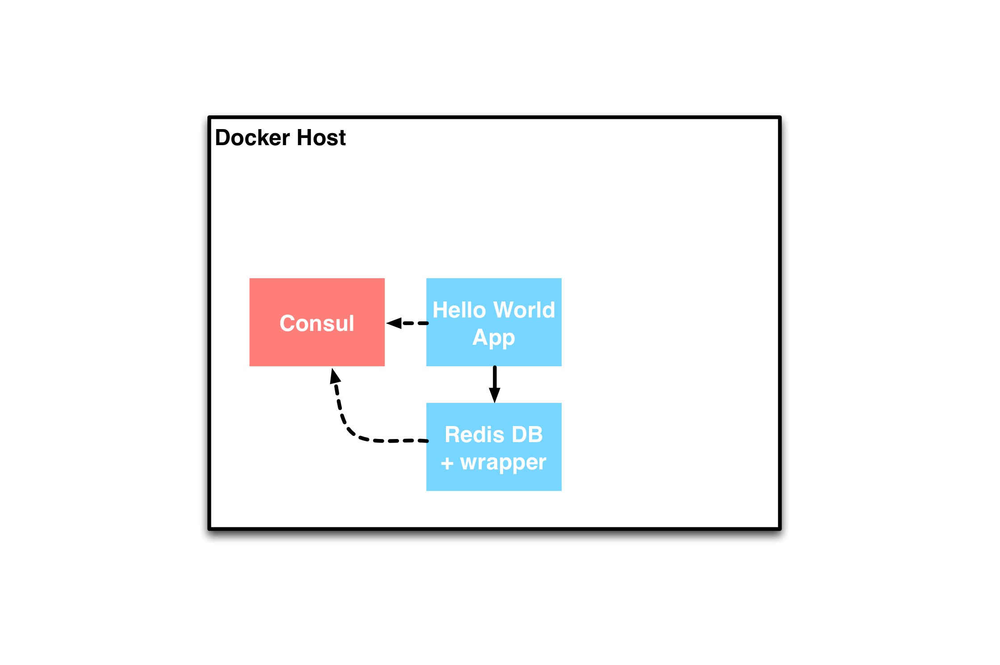
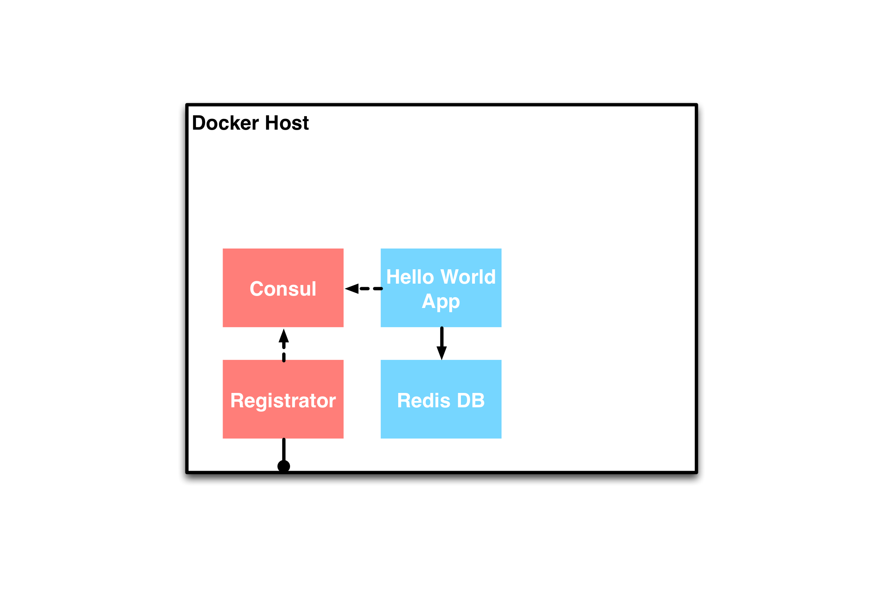

### part2
# Consul
 <!-- .element: class="noborder" -->


!SUB
## Consul introduction

Consul "is a tool for discovering and configuring services in your infrastructure"


[_consul.io_](http://www.consul.io)


!SUB
### Consul Features

 - Service discovery
 - Health checking
 - Key value store
 - Multi-datacenter


[_consul.io_](http://www.consul.io)


!SUB

### Consul works with

 - Peer to peer networking
 - Gossip protocol (Serf)
 - An agent per node
 - A DNS interface (compatibility)
 - A REST interface (rich API)


!SLIDE
### part2a
 <!-- .element: class="noborder" -->

## service discovery using Consul


!SUB
### Consul Service Discovery interfaces

- DNS: Simple, no changes to application needed, legacy-friendly
- HTTP: For richer metadata


<br>We'll be using Consul's DNS interface for this example


!SUB
### Docker with Consul DNS based Service Discovery
Docker can supply [custom DNS configurations](https://docs.docker.com/articles/networking/#configuring-dns) to containers

This allows us to use the DNS Service Discovery interface provided by Consul with all our containers


!SUB
### Docker Daemon settings
#### For Consul's DNS based Service Discovery
- Use Consul as DNS for the Docker Host
- Expose this DNS to all containers:<br>`--dns <IP of docker0>`
- Add search domain to facilitate lookup:<br>`--dns-search service.consul`

<small>(these settings have already been applied in the Docker host image you're using)</small>


!SUB
### Consul settings
#### To use Consul as a DNS server for the Docker host
- We have to tell Consul to bind it's DNS<br>and HTTP interfaces to the Docker host

- We do this by adding the `-client 0.0.0.0`<br>argument to Consul

<small>(this has already been done in the [cargonauts/consul-web image](https://registry.hub.docker.com/u/cargonauts/consul-web/) we're using)</small>


!SUB
### Publishing Consul's ports to the host
Finally when we run the Consul container we have to publish it's DNS and HTTP ports with the following Docker run arguments

- DNS: `-p 53:53/udp`
- HTTP: `-p 8500:8500`

<small>(this has already been done in the `part2/Vagrantfile`)</small>


!SUB
Example `Vagrantfile`
```
Vagrant.configure("2") do |config|
...
  config.vm.define "consul" do |consul|
    consul.vm.provider "docker" do |d|
      d.image = "cargonauts/consul-web"
      d.ports = ['53:53/udp', '8500:8500']
    end
  end
...
end
```


!SUB
### Part2a Exercise


!SUB
Start the Dockerized Consul
```
$ cd part2a
# Start the container
$ vagrant up
Bringing machine 'consul' up with 'docker' provider...
==> consul: Docker host is required. One will be created if necessary...
    consul: Docker host VM is already ready.
    ...
```


!SUB
To publish services to Consul and check the results we need some tools.

They are prepackaged in the [`cargonauts/toolbox-networking`](https://registry.hub.docker.com/u/cargonauts/toolbox-networking/) Docker image.
```
$ docker run -ti cargonauts/toolbox-networking
```


!SUB
Now we can see if the Consul DNS service works
```
root@fc2959ba5207:/# ping -c 3 consul.service.consul
PING consul.service.consul (172.17.0.6): 48 data bytes
56 bytes from 172.17.0.6: icmp_seq=0 ttl=64 time=0.052 ms
56 bytes from 172.17.0.6: icmp_seq=1 ttl=64 time=0.164 ms
56 bytes from 172.17.0.6: icmp_seq=2 ttl=64 time=0.189 ms
--- consul.service.consul ping statistics ---
3 packets transmitted, 3 packets received, 0% packet loss
round-trip min/avg/max/stddev = 0.052/0.135/0.189/0.060 ms
```


!SUB
Since we've added `service.consul` as a search domain we can also reach a service without the `consul.service` postfix
```
root@fc2959ba5207:/# ping -c 3 consul #without the service.consul postfix
PING consul.service.consul (172.17.0.8): 48 data bytes
56 bytes from 172.17.0.8: icmp_seq=0 ttl=64 time=0.042 ms
56 bytes from 172.17.0.8: icmp_seq=1 ttl=64 time=0.074 ms
56 bytes from 172.17.0.8: icmp_seq=2 ttl=64 time=0.073 ms
--- consul.service.consul ping statistics ---
3 packets transmitted, 3 packets received, 0% packet loss
round-trip min/avg/max/stddev = 0.042/0.063/0.074/0.000 ms
```


!SUB
We can use `nslookup` to check the DNS records
```
root@fc2959ba5207:/# nslookup consul
Server:   172.17.42.1
Address:  172.17.42.1#53

Name: consul.service.consul
Address: 172.17.0.8
```


!SUB
Use Consul's HTTP interface to register a service
```
root@fc2959ba5207:/# curl -X POST  -w "%{http_code}\n" http://consul:8500/v1/agent/service/register \
  --header 'Content-Type: application/json' \
  --data-binary '{"ID": "manualapp1", "Name": "manualapp", "Address": "123.4.5.6", "Port": 8888}'
200
```


!SUB
Now check if we can find our new service
```
root@fc2959ba5207:/# nslookup manualapp
Server:   172.17.42.1
Address:  172.17.42.1#53

Name: manualapp.service.consul
Address: 123.4.5.6
```


!SUB
### Consul WebUI
Consul also has an optional Web Interface

It's available at the same port as Consul's HTTP interface, which we've published to the Docker host at

[192.168.190.85:8500](http://192.168.190.85:8500)


!SUB
Remove the manually created service
```
root@fc2959ba5207:/# curl -X POST  -w "%{http_code}\n" \
	http://consul:8500/v1/agent/service/deregister/manualapp1
```
And check using nslookup or in the Consul WebUI if it's no longer there


!SUB
### Cleanup
```
# Exit the container
root@fc2959ba5207:/# exit
# And stop the Consul container
$ vagrant destroy
```


!SLIDE
### part2b
 <!-- .element: class="noborder" -->

## Automatic Service Discovery using Service Wrapper


!SUB
Wrapper script for Redis service to (de)register with Consul
```
#!/usr/bin/env bash
export CONTAINERIP=$(hostname -I | cut -f1 -d' ')

function deregister() {
    echo "Trapping exit"
    curl -X POST http://consul.service.consul:8500/v1/agent/service/deregister/redis-$HOSTNAME \
        --header 'Content-Type: application/json'
    kill -SIGTERM -1
}
trap "deregister" EXIT

# start app
/entrypoint.sh redis-server &

# register with consul
curl -X POST http://consul.service.consul:8500/v1/agent/service/register \
    --header 'Content-Type: application/json' \
    --data-binary '{"ID": "'"redis-$HOSTNAME"'", "Name": "redis", "Address": "'"$CONTAINERIP"'", "Port": 6379}'

while true; do :; done
```


!SUB
Script will automatically registering a service

Script will (try) to deregister when service is stopped


!SUB
### Exercise
Start the Dockerized Consul, app and database
```
$ cd part2b
# Start the containers
$ vagrant up --no-parallel
Bringing machine 'consul' up with 'docker' provider...
Bringing machine 'redis' up with 'docker' provider...
Bringing machine 'hellodb' up with 'docker' provider...
==> consul: Docker host is required. One will be created if necessary...
    consul: Docker host VM is already ready.
```


!SUB
Check if the containers are running
```
$ vagrant status
Current machine states:
consul                    running (docker)
redis                     running (docker)
hellodb                   running (docker)

$ docker ps
CONTAINER ID        IMAGE                                 COMMAND                CREATED             STATUS              PORTS                                        NAMES
d2ae67636d87        cargonauts/helloworld-python:latest   "/srv/helloworld-db.   5 seconds ago       Up 5 seconds        0.0.0.0:80->80/tcp                           part2b_hellodb_1425939265
acf83ec7d53e        725aaab11629                          "/redis-wrapper.sh"    7 seconds ago       Up 6 seconds        6379/tcp                                     part2b_redis_1425939263
2f619284f361        cargonauts/consul-web:latest          "/consul agent -serv   8 seconds ago       Up 8 seconds        0.0.0.0:53->53/udp, 0.0.0.0:8500->8500/tcp   part2b_consul_1425939262
```

!SUB
Check if the application works, visit [192.168.190.85](http://192.168.190.85)

Open [Consul Web UI](http://192.168.190.85:8500/) to check redis service

!SUB
So, now we've added Consul to our topology:
 <!-- .element: class="noborder" -->


!SUB
### Exercise
Stopping the container unregisters it
```
$ vagrant halt redis
==> redis: Stopping container...
```
Check [Consul Web UI](http://192.168.190.85:8500/) to see the service is removed


!SUB
However, killing the container does not unregister it
```
$ vagrant up redis
Bringing machine 'redis' up with 'docker' provider...

$ docker ps
CONTAINER ID        IMAGE                                 COMMAND                CREATED             STATUS                  PORTS                                        NAMES
83ba3eeebb09        8aadfc5033d3                          "/redis-wrapper.sh"    1 seconds ago       Up Less than a second   6379/tcp                                     part2b_redis_1425939638
d2ae67636d87        cargonauts/helloworld-python:latest   "/srv/helloworld-db.   6 minutes ago       Up 6 minutes            0.0.0.0:80->80/tcp                           part2b_hellodb_1425939265
2f619284f361        cargonauts/consul-web:latest          "/consul agent -serv   6 minutes ago       Up 6 minutes            0.0.0.0:53->53/udp, 0.0.0.0:8500->8500/tcp   part2b_consul_1425939262

# Force kill Redis container
$ docker kill 83ba3eeebb09
83ba3eeebb09
```
Check [Consul Web UI](http://192.168.190.85:8500/) to see the service is still there


!SUB
Conclusion: Can't guarantee cleanup from within a container

So the service registry should be updated from outside the container


!SLIDE
### part2c
 <!-- .element: class="noborder" -->
## Automatic Service Discovery using Consul and Registrator


!SUB
Solution: listen to the Docker event stream

Using Jeff Lindsay's [registrator](https://github.com/gliderlabs/registrator)


!SUB
Automatically register & unregister a container using registrator

!SUB

We've replaces the service wrapper script<br>with Registrator in the topology:
 <!-- .element: class="noborder" -->


!SUB
### Exercise
Start the Consul, Regsitrator, app and database
```
$ cd part2c
# Start the containers
$ vagrant up --no-parallel
Bringing machine 'consul' up with 'docker' provider...
Bringing machine 'registrator' up with 'docker' provider...
Bringing machine 'redis' up with 'docker' provider...
Bringing machine 'hellodb' up with 'docker' provider...
```


!SUB
Check if the containers are running
```
$ vagrant status
Current machine states:
consul                    running (docker)
registrator               running (docker)
redis                     running (docker)
hellodb                   running (docker)

$ docker ps
CONTAINER ID        IMAGE                                 COMMAND                CREATED              STATUS              PORTS                                        NAMES
8d03c3af593e        cargonauts/helloworld-python:latest   "/srv/helloworld-db.   About a minute ago   Up About a minute   0.0.0.0:80->80/tcp                           part2c_hellodb_1425940254
97684b24fbb2        redis:latest                          "/entrypoint.sh redi   About a minute ago   Up About a minute   0.0.0.0:6379->6379/tcp                       part2c_redis_1425940253
ddfccf6a0076        gliderlabs/registrator:latest         "/bin/registrator co   About a minute ago   Up About a minute                                                part2c_registrator_1425940251
67a309668d3f        cargonauts/consul-web:latest          "/consul agent -serv   About a minute ago   Up About a minute   0.0.0.0:53->53/udp, 0.0.0.0:8500->8500/tcp   part2c_consul_1425940250
```

!SUB
Check if the application works, visit [192.168.190.85](http://192.168.190.85)

Open [Consul Web UI](http://192.168.190.85:8500/) to check redis service, now created by Registrator!

